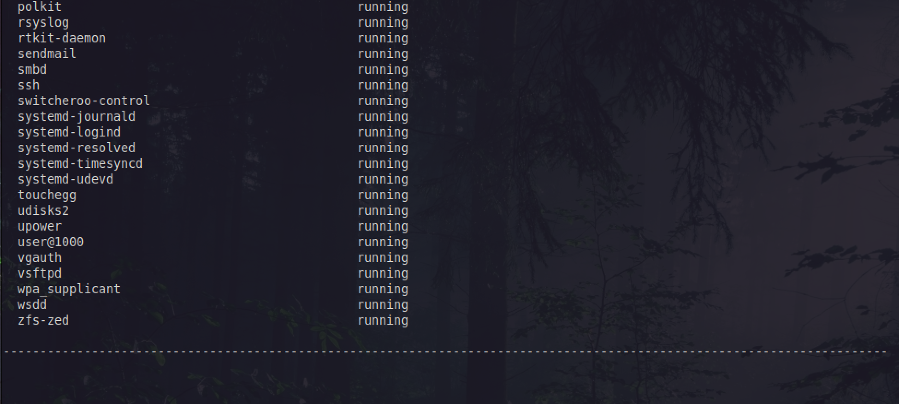
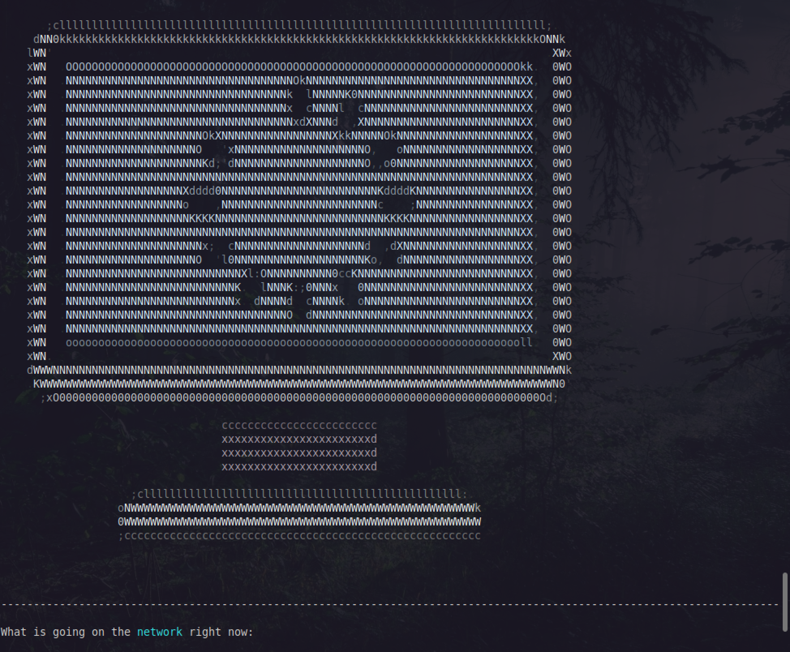

# Linux Monitor Script

## Script explanation:

It is a script to execute on my Mint VM that show some log about my monitoring.
I won't get in details about every commands but here is what is done:

- Greetings, neofetch.
- Ip and internet status.
- %CPU remaining
- Disk space
- Uptime
- Logged-ins users
- Services running
- Network quick analyze
- Cron

I added some functionnalities:

A mail is send in case of the %CPU remaining are 5% or less.
I used sengrid to do it and an .expect script that you can find in this repo.

Another email is also send once a week by cron that send this report by mail. I used a simplified version of the script to render correctly by mail.

I added some spacing, dash delimiters and images made with jp2a of Tux and a Computer.
I also used a custom font to display greetings and goodbye and added some colors in the script text.

You can get details about the commands used in the script on the .sh file in this repo.
